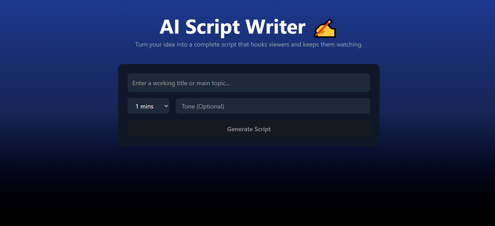

# AI Script Writer ✍️

Turn your ideas into engaging YouTube scripts instantly! This project uses OpenAI's GPT API to generate full-length scripts with hooks, context, tension, climax, and an outro.

---

## Features

- Generate YouTube scripts based on a title/topic
- Optional tone selection for personalized scripts
- Choose script length (1 min to 30 mins)
- Real-time error handling for API quota or server issues
- Clean, modern UI built with React and Tailwind CSS

---

## Demo

  
*Replace with your own screenshot if available.*

---

## Tech Stack

- **Frontend:** React, Tailwind CSS  
- **Backend:** Vercel Serverless Functions (API routes)  
- **AI:** OpenAI GPT-4o-mini

---

## Live Demo

Check it out here: [https://script-writer-eosin.vercel.app/]
